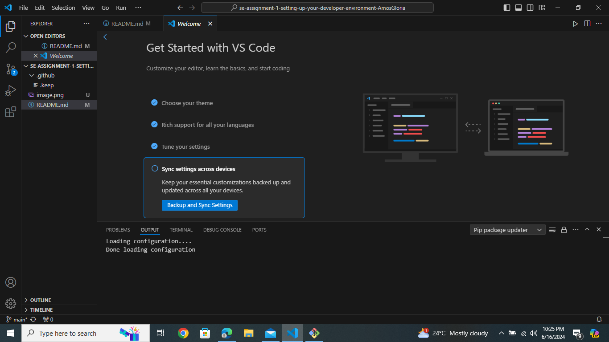
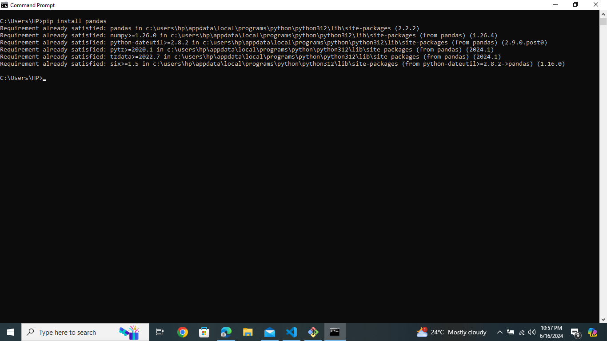
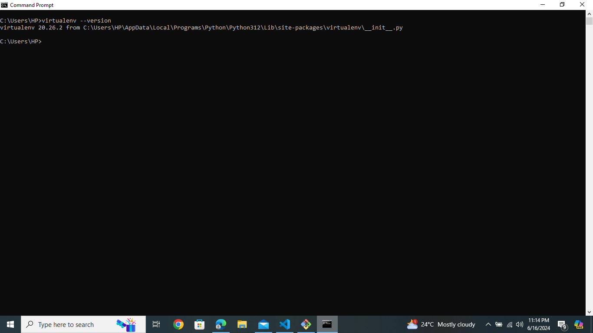
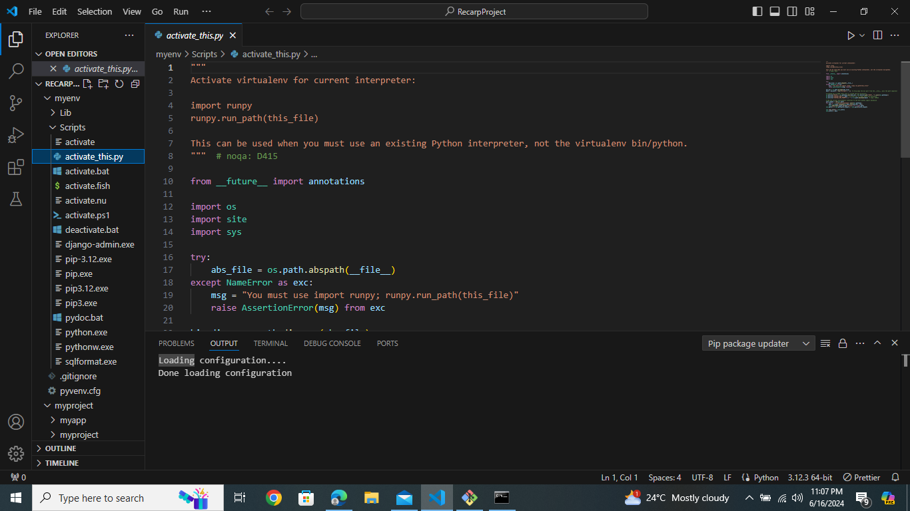
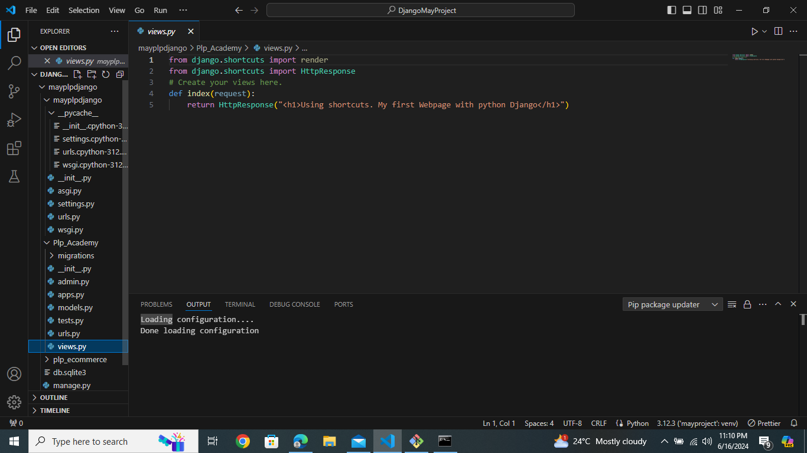
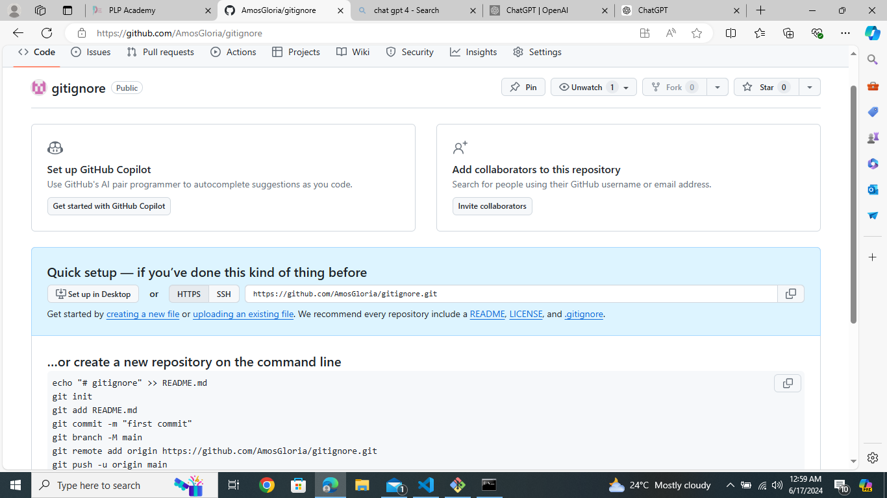

# Dev_Setup
Setup Development Environment

#Assignment: Setting Up Your Developer Environment

#Objective:
This assignment aims to familiarize you with the tools and configurations necessary to set up an efficient developer environment for software engineering projects. Completing this assignment will give you the skills required to set up a robust and productive workspace conducive to coding, debugging, version control, and collaboration.

#Tasks:

1. Select Your Operating System (OS):
   Choose an operating system that best suits your preferences and project requirements. Download and Install Windows 11. https://www.microsoft.com/software-download/windows11

2. Install a Text Editor or Integrated Development Environment (IDE):
This is a screenshot of my Visual Studio Code.

 
3. Set Up Version Control System:
   Install Git and configure it on your local machine. Create a GitHub account for hosting your repositories. Initialize a Git repository for your project and make your first commit. https://github.com
Py
   
4. Install Necessary Programming Languages and Runtimes:
  Instal Python from http://wwww.python.org programming language required for your project and install their respective compilers, interpreters, or runtimes. Ensure you have the necessary tools to build and execute your code.

  

Python version screenshot:
.

numpy screenshot:

pandas screenshot:

virtualenv screenshot

Django screenshot:

5. Install Package Managers:
   If applicable, install package managers like pip (Python).

   
pip screenshot:

6. Configure a Database (MySQL):
  MySQL screenshot:
  

7. Set Up Development Environments and Virtualization (Optional):
   Consider using virtualization tools like Docker or virtual machines to isolate project dependencies and ensure consistent environments across different machines.

8. Explore Extensions and Plugins:
   Explore available extensions, plugins, and add-ons for your chosen text editor or IDE to enhance functionality, such as syntax highlighting, linting, code formatting, and version control integration.

   

   

9. Document Your Setup:
    Create a comprehensive document outlining the steps you've taken to set up your developer environment. Include any configurations, customizations, or troubleshooting steps encountered during the process. 

    PYTHON INSTALLATION ON WINDOWS
    Installing and configuring Python involves several straightforward steps. Below, I'll outline the process for installing Python on a Windows system and basic configuration steps:

Installing Python on Windows
Download Python Installer:

Visit the official Python website and download the latest version of Python (preferably Python 3.x) 

Run Python Installer:

Once the download is complete, run the installer (python-3.x.x.exe).

Check the box that says "Add Python x.x to PATH" during the installation process.

Click "Install Now" and follow the prompts to complete the installation.

Verify Installation:

Open Command Prompt or PowerShell and type: python --version

Installing Python on Windows
Download Python Installer:

Visit the official Python website and download the latest version of Python (preferably Python 3.x).
Run Python Installer:

Once the download is complete, run the installer (python-3.x.x.exe).
Check the box that says "Add Python x.x to PATH" during the installation process.
Click "Install Now" and follow the prompts to complete the installation.
Verify Installation:

Open Command Prompt or PowerShell and type: python --version.

Configuring Python Environment Variables (Optional)

VISUAL STUDIO CODE INSTALLATION AND CONFIGURATION

Installing and configuring Visual Studio Code (VS Code) involves a few straightforward steps. Below, I'll outline the process for installing VS Code on Windows and basic configuration steps to get you started:

Installing Visual Studio Code on Windows
Download VS Code Installer:

Visit the official Visual Studio Code website and download the installer for Windows.

Run VS Code Installer:

Once the download is complete, run the installer (VSCodeSetup-x64-x.x.x.exe).
Follow the prompts to install VS Code with the default settings.

Launch VS Code:

After installation, launch VS Code by double-clicking its icon on the desktop or from the Start menu.
Basic Configuration of Visual Studio Code

Extensions:

VS Code supports extensions that provide additional features and language support. Here are some essential extensions for Python development:
Python Extension: Provides Python language support, debugging, and IntelliSense.

Visual Studio IntelliCode: Enhances IntelliSense with AI-assisted recommendations.

GitLens: Adds Git version control features directly into VS Code.

To install extensions:

Click on the Extensions view icon on the Sidebar (or press Ctrl+Shift+X).
Search for the extension you want to install, then click "Install".

Configure Python Interpreter:

Open a Python project or create a new one.
Open the Command Palette (press Ctrl+Shift+P or Cmd+Shift+P on macOS).

Type and select "Python: Select Interpreter".
Choose the Python interpreter from your virtual environment (venv directory) if you've created one.
Settings:

Customize VS Code settings by clicking on the gear icon on the lower left corner (Settings) or by pressing Ctrl+, (comma).
Modify settings such as font size, theme, and editor preferences to suit your needs.
Integrated Terminal:

VS Code includes an integrated terminal that you can use to run commands directly within the editor.
Open the integrated terminal with Ctrl+` (backtick).
Debugging:

VS Code provides a powerful debugging interface. To set up a debugger:
Create or open a Python file.
Set breakpoints by clicking in the gutter next to line numbers.
Use F5 or click on the debug icon on the Sidebar to start debugging.
Version Control with Git:

If you have Git installed (if not, install it from git-scm.com), you can use it directly within VS Code.
Initialize a Git repository or open an existing one using the Source Control view (Ctrl+Shift+G).
Example Workflow
Install VS Code:

Download and run the VS Code installer from the official website.
Launch VS Code:

Open VS Code from the Start menu or desktop shortcut.
Install Extensions:

Install essential extensions like Python, Visual Studio IntelliCode, and GitLens.
Configure Python:

Select the Python interpreter from your virtual environment using the Command Palette (Ctrl+Shift+P > "Python: Select Interpreter").
Start Coding:

Open a Python file (File > Open Folder) or create a new one.
Write Python code, save the file with a .py extension, and run/debug it directly from VS Code.
Manage Version Control:

Use Git commands within VS Code or through the integrated Source Control view (Ctrl+Shift+G) to manage version control.

Installation of virtualenv(Virtual Environment)

Install virtualenv:

Open a terminal or command prompt on your system.
Install virtualenv using pip (assuming Python and pip are already installed):
pip install virtualenv

This command installs virtualenv globally on your system.

Verify Installation:

After installation, verify virtualenv by checking its version:
virtualenv --version

This command should display the installed version of virtualenv.

Creating and Using Virtual Environments

Create a Virtual Environment:

Decide on a directory where you want to create the virtual environment (e.g., within your project directory).
Open a terminal or command prompt and navigate to the directory where you want to create the virtual environment.
Create the Virtual Environment:

Use virtualenv to create a new virtual environment:
virtualenv venv
Replace venv with your preferred name for the virtual environment.

Activate the Virtual Environment:

Activate the virtual environment:
Windows:
venv\Scripts\activate

Your command prompt will now show the name of the virtual environment ((venv)).
Deactivate the Virtual Environment:

To deactivate the virtual environment and return to your global Python environment, simply type:
deactivate
Example Workflow
Here’s a step-by-step example to illustrate how you might use virtualenv in practice:

Create a New Project Directory:

Create a new directory for your Python project:
bash
mkdir myproject
cd myproject
Install virtualenv and Create Virtual Environment:

Install virtualenv if you haven't already (see installation steps above).
Create a virtual environment named venv:
virtualenv venv

Activate the Virtual Environment:

Activate the virtual environment:
Windows:
source venv/bin/activate
Install Packages:

While the virtual environment is activated, install Python packages using pip. For example:
pip install numpy pandas

Deactivate the Virtual Environment:

Once you're done working in the virtual environment, deactivate it:

deactivate

#Deliverables:
- Document detailing the setup process with step-by-step instructions and screenshots where necessary.
- A GitHub repository containing a sample project initialized with Git and any necessary configuration files (e.g., .gitignore).

- A reflection on the challenges faced during setup and strategies employed to overcome them.

CHALLENGES:
Setting up my environment was not difficult since I folllowed keenly on every step explained by Power Learn Project amazing tutors however I am still struggling to get used to using these environments.

#Submission:
Submit your document and GitHub repository link through the designated platform or email to the instructor by the specified deadline.

#Evaluation Criteria:**
- Completeness and accuracy of setup documentation.
- Effectiveness of version control implementation.
- Appropriateness of tools selected for the project requirements.
- Clarity of reflection on challenges and solutions encountered.
- Adherence to submission guidelines and deadlines.

Note: Feel free to reach out for clarification or assistance with any aspect of the assignment.
